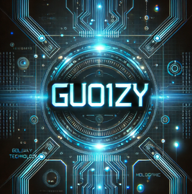

  # Chat-GPT with ROS  

  

  

 
  
  

    
  

> [!NOTE]
> 本项目仅限个人开发玩乐，请勿用于商业用途

> [!IMPORTANT]
> 使用者必须在遵循 OpenAI 的[使用条款](https://openai.com/policies/terms-of-use)以及**法律法规**的情况下使用，不得用于非法用途。
> 根据[《生成式人工智能服务管理暂行办法》](http://www.cac.gov.cn/2023-07/13/c_1690898327029107.htm)的要求，请勿对中国地区公众提供一切未经备案的生成式人工智能服务。
> 该项目API仅用于非商业性的学习、研究、科研测试等合法用途，不得用于任何违法违规用途以及商业用途，否则后果自负。

> [!TIP]
> 本项目仅供个人学习使用，不保证稳定性，且不提供任何技术支持。  
>  本项目是作者自己购买的API tokens,请节省使用

## 项目介绍

1. 完全免费使用以下勾选模型：
   + [x] gpt-3.5-turbo
   + [x] gpt-3.5-turbo-0125
   + [x] gpt-3.5-turbo-1106
   + [x] gpt-3.5-turbo-0613
   + [x] gpt-3.5-turbo-16k
   + [x] gpt-3.5-turbo-16k-1603
   + [x] gpt-4
   + [x] gpt-4-0314
   + [x] gpt-4-turbo-preview(不太稳定）
   + [ ] gpt-4全系列（只定期限量开放）
   + [ ] 付费版API支持OpenAI所有模型，包括（联网、绘画、聊天、向量、图片分析、文件分析、GPTs等）
   + [ ] 付费版API支持Midjourney专业绘画、Suno音乐生成、PPT生成、多种视频模型。
2. 标准的OpenAI接口请求格式。
3. 支持流式响应输出。
4. 完美兼容各类开源的GPT项目/应用/软件。
